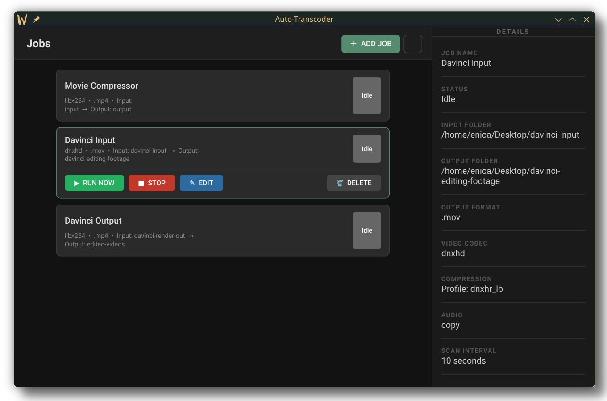

# Convenient-Transcoder

> A desktop watch-folder transcoding app built with Python and PySide6. Drop files into a folder, Auto-Transcoder picks them up automatically and converts them using ffmpeg — no terminal required.



---

## Features

- **Watch folders** — each job monitors an input folder on a configurable interval and transcodes any new files it finds
- **Multiple codec presets** — H.264 (CRF), H.265 / HEVC (CRF), Apple ProRes (proxy / lt / standard / hq / 4444), Avid DNxHR (lb / sq / hq / hqx / 444), and lossless remux (copy)
- **Per-job audio selection** — copy, AAC, or PCM

---

## Installation

### Requirements

- Python 3.11+
- pip

ffmpeg and ffprobe are **not** required — the app will download them automatically on first launch if they are missing.
> **Note:** The automatic binary downloader currently fetches Linux x64 and Windows x64 builds. On macOS you will need to provide your own ffmpeg binaries via [Homebrew](https://formulae.brew.sh/formula/ffmpeg):
> ```bash
> brew install ffmpeg
> # Then symlink or copy into the bin/ folder:
> mkdir -p bin
> ln -s $(which ffmpeg)  bin/ffmpeg
> ln -s $(which ffprobe) bin/ffprobe
> ```

---

### Linux / macOS

```bash
# 1. Clone the repo
git clone https://github.com/your-username/auto-transcoder.git
cd auto-transcoder

# 2. Create and activate a virtual environment
python3 -m venv venv
source venv/bin/activate

# 3. Install dependencies
pip install -r requirements.txt

# 4. Run
python main.py
```

If you prefer to provide your own ffmpeg binaries, place them at:

```
bin/ffmpeg
bin/ffprobe
```

and make sure they are executable (`chmod +x bin/ffmpeg bin/ffprobe`).

---

### Windows

```powershell
# 1. Clone the repo
git clone https://github.com/your-username/auto-transcoder.git
cd auto-transcoder

# 2. Create and activate a virtual environment
python -m venv venv
venv\Scripts\activate

# 3. Install dependencies
pip install -r requirements.txt

# 4. Run
python main.py
```

ffmpeg and ffprobe will be downloaded automatically on first launch.

---

## Usage

### Adding a job

1. Click **＋ Add Job** in the top-right of the main window
2. Fill in:
   - **Job Name** — a label shown on the card
   - **Input Folder** — the folder to watch for new video files
   - **Output Folder** — where transcoded files will be saved
   - **Scan Interval** — how often (in seconds) to check for new files
   - **Output Codec** — the encoding format to use
   - **Output Format** — the container extension (`.mp4`, `.mov`, `.mxf`, etc.)
   - **Compression** — CRF value (lower = better quality, larger file) or a profile name depending on the codec
   - **Audio** — output audio codec
3. Click **OK** — the job starts watching immediately

---

## Supported input formats

`.mp4` `.mov` `.mxf` `.avi` `.mkv` `.m4v` `.wmv` `.flv` `.webm` `.ts` `.mpg` `.mpeg` `.m2t` `.m2ts` `.dv` `.r3d` `.braw`

---

## Config file location

Jobs are saved automatically after every change. The config file lives at:

| Platform | Path |
|---|---|
| Linux | `~/.config/AutoTranscoder/jobs.json` |
| macOS | `~/Library/Application Support/AutoTranscoder/jobs.json` |
| Windows | `%APPDATA%\AutoTranscoder\jobs.json` |

---

## Dependencies

```
PySide6
```

Everything else is Python standard library.

---

## License

MIT
